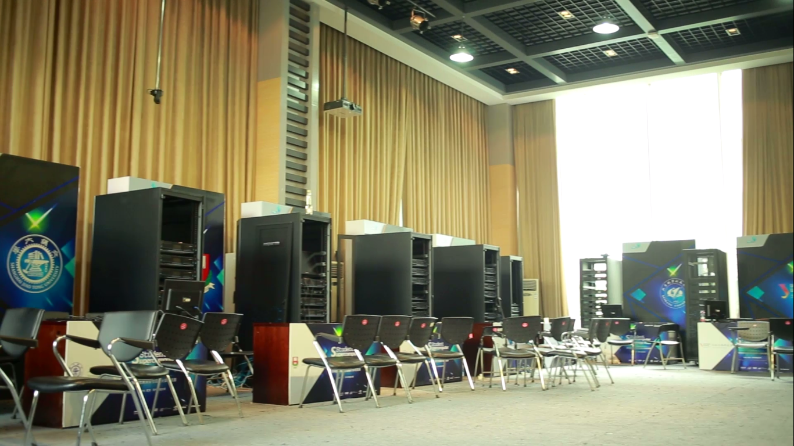
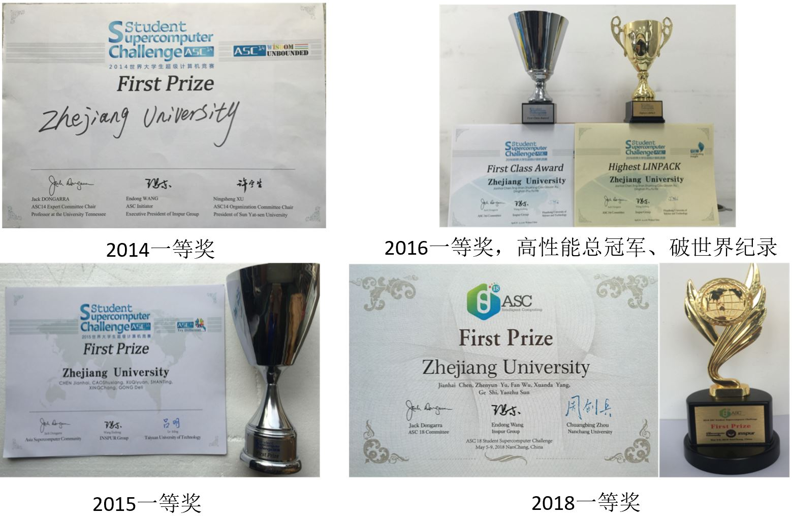

## 竞赛目的

ASC超算竞赛旨在通过大赛的平台推动各国及地区间超算青年人才交流和培养，提升超算应用水平和研发能力，发挥超算的科技驱动力，促进科技与产业创新。吸引本科生参加超级计算机竞赛以培养学生在超算并行、高性能计算方面的动手实践能力，促进课程理论知识与实践能力的结合。

## 竞赛内容

竞赛总共由数道题目组成, 每一道赛题都是对现代科学难题的挑战，需要考验参赛队伍的分析解决问题以及团队协同作战的综合能力。比赛要求每个队伍完成超级计算机集群的设计与搭建，要求选手必须要具备驾驭计算机软硬件操作系统的整体能力，还要在自搭建的集群计算机系统上完成面向前沿科技领域难题的科学应用软件的高性能优化，要具备程序并行优化编码能力。竞赛分为多个流程：理论方案、设计模型、实现、现场展示、答辩等。

## 奖项设置

+ ASC 超算竞赛： 总冠军、亚军各1 项，ePrize 奖1 项（季军），最高计算性能HPL 冠军，最佳应用创新奖，最佳应用奖，最佳呈现奖及一等奖若干
+ ISC/SC 超算竞赛： 总冠军一名，授予在整体算例以及现场呈现过程中得分最高的队伍。最高计算性能：HPL 单项冠军一名，授予HPL 比赛成绩最高的队伍。最受欢迎奖一名，授予比赛期间得到ISC 参会者投票最多的队伍。难度一样，规模比ASC稍小。

## 浙江大学历年成绩

* ASC2014 世界大学生超级计算机竞赛一等奖
* ASC2015 世界大学生超级计算机竞赛一等奖
* ASC2016 世界大学生超级计算机竞赛一等奖
* ASC2016 世界最高计算性能冠军奖
* ASC2016 世界最高计算性能打破世界纪录
* ASC2018 世界大学生超级计算机竞赛初赛第四名 决赛一等奖

超算队还开设短学期课程 超算团队与信息安全竞赛、系统设计能力竞赛、程序设计竞赛一起，共同推进以计算机系统能力为基础的人才培养改革与课程建设。超算基地近5 年来的人才培养与成果积累，参与申报2017 年“系统能力建设教学成果奖评比”项目，获浙江省教学成果一等奖。与ACM算法竞赛同为浙江大学**世界级学科竞赛**项目 拥有保研名额。

