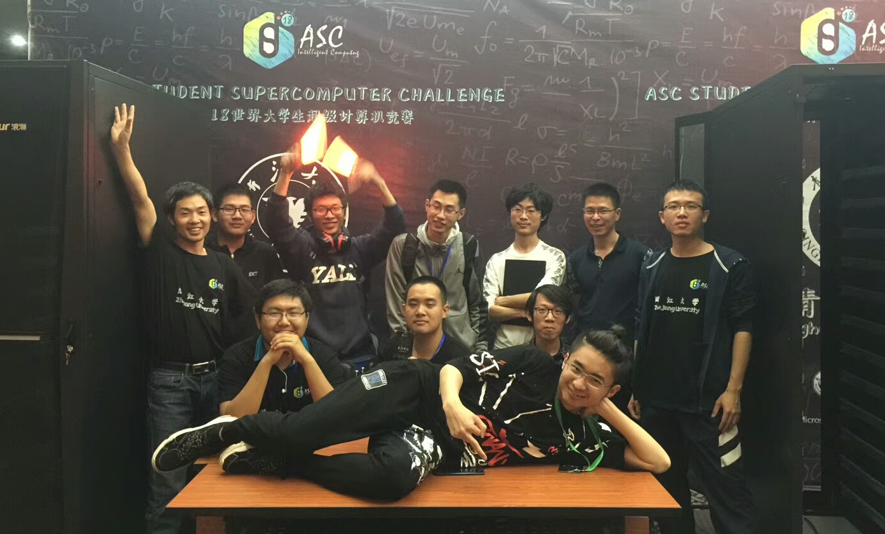
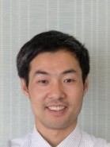
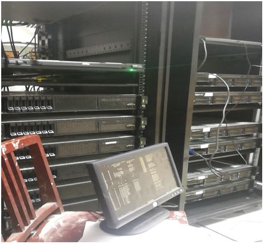
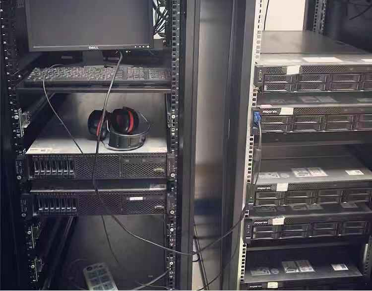
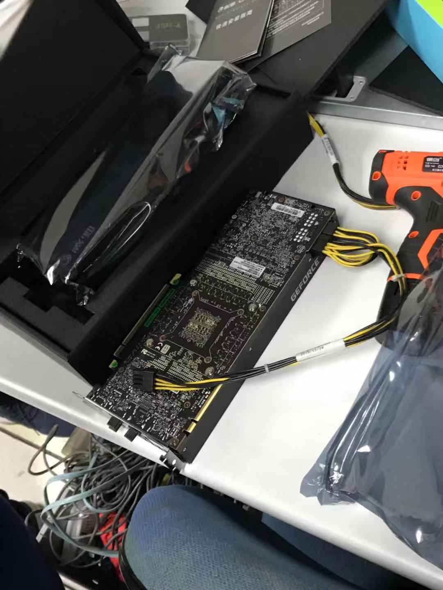

---

title: Team Introduction
date: 2018-11-05 13:01:49
---

## 超算队指导老师介绍

**陈建海老师**

陈建海，博士，浙江大学计算机学院。浙江大学计算机学院智能计算&系统实验室（InCAS-LAB）区块链负责人，IEEE、ACM、CCF会员。研究领域：计算机体系结构领域，涉及云计算、虚拟化、区块链，擅长区块链系统性能与安全，虚拟计算系统性能优化与调度，高性能计算并行应用优化，近似算法与博弈论运用等。 负责区块链、高性能计算方面的重点研发项目子课题2项，参与完成多项云计算虚拟化相关的国家科技部支撑计划、国家基金以及企业合作项目。累计发表SCI/EI论文15篇，申请授权专利超过30项。 第44界世界技能大赛网站设计项目浙江省技术专家组组长，国家级裁判，带领浙江省队员获44界世界技能大赛全国选拔赛第四名。主持Designer项目获2018全球迅雷区块链应用开发大赛第一名。

**沈钦仙老师**

## 学校支持 设备介绍

**计算机学院超算竞赛基地**

* 吸引本科生参加超级计算机竞赛以培养学生在超算并行、高性能计算方面的动手实践能力，促进课程理论知识与实践能力的结合
* 开设暑期超算集训短学期课程
* 学院提供超算竞赛基地，支持每年8万元经费

  
  
  

**硬件强支撑**：学校与学院支持建有13节点百万超算集群，含GPU\MAC卡等异构设备

## 赞助与合作介绍

* ASC2016 获英伟达硬件Tesla GPU K80 加速卡硬件赞助
* ASC2018 获AMAX 赞助借用硬件Tesla GPU V100 8块  
* ······

